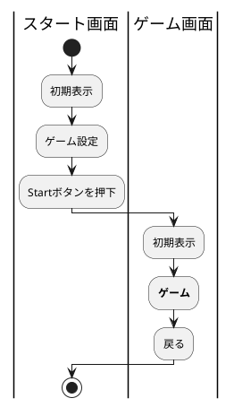
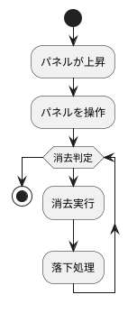

# 機能仕様

## 処理フロー

```plantuml
@startuml

|スタート画面|
start
:初期表示;
:ゲーム設定;
:Startボタンを押下;
|ゲーム画面|
:初期表示;
:**ゲーム**;
:戻る;
|スタート画面|
stop

@enduml
```

## ゲームフロー

```plantuml
@startuml
start
:パネルが上昇;
:パネルを操作;
while (消去判定)
  :消去実行;
  :落下処理;
end while

stop
@enduml
```
