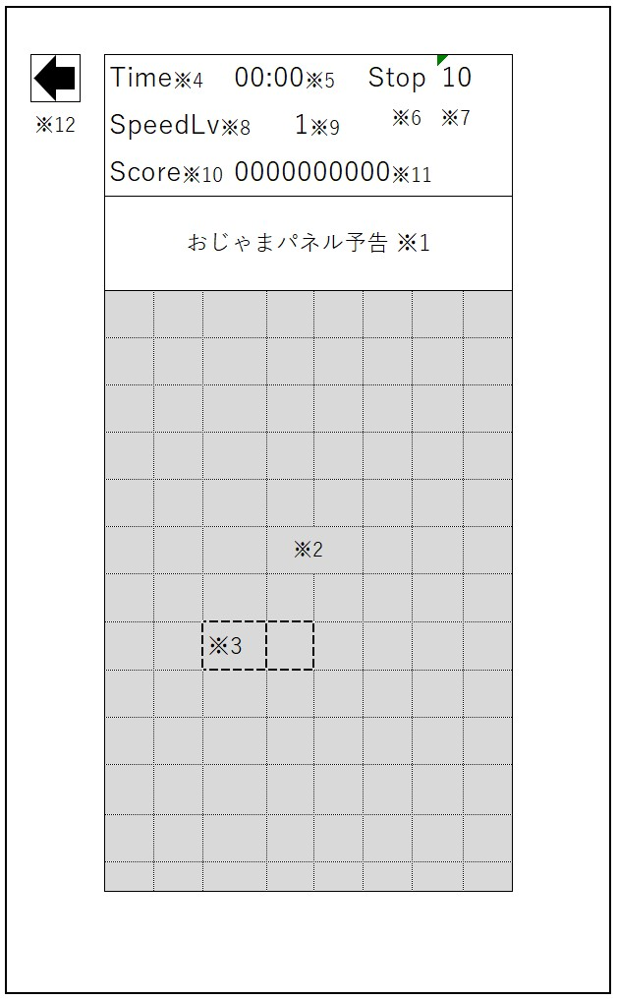

# 画面設計

## 1. スタート画面

### 1.1. 画面イメージ

### 1.2. 項目定義

#### 1.2.1. タイトル

#### 1.2.2. スタート

#### 1.2.3. ゲームスピード

#### 1.2.4. メーター

#### 1.2.5. おじゃまパネル

#### 1.2.6. おじゃま有無

## 2. ゲーム画面

### 2.1. 画面イメージ

### 2.2. 項目定義

#### 2.2.1. おじゃまパネル予告

#### 2.2.2. フィールド

#### 2.2.3. カーソル

#### 2.2.4. タイム

#### 2.2.5. タイム値

#### 2.2.6. ストップ

#### 2.2.7. 停止時間

#### 2.2.8. スピードレベル

#### 2.2.9. スピードレベル値

#### 2.2.10. スコア

#### 2.2.11. スコア値
